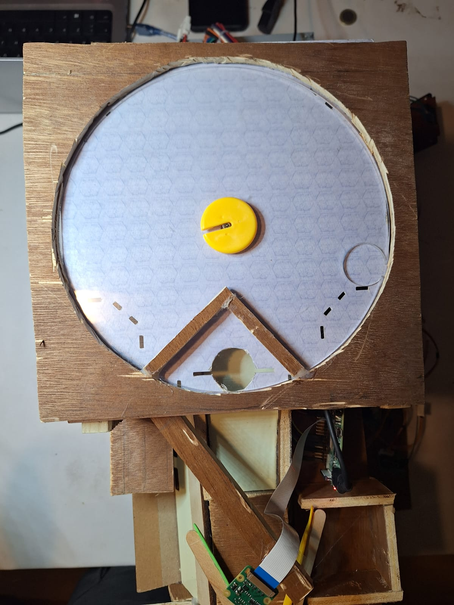
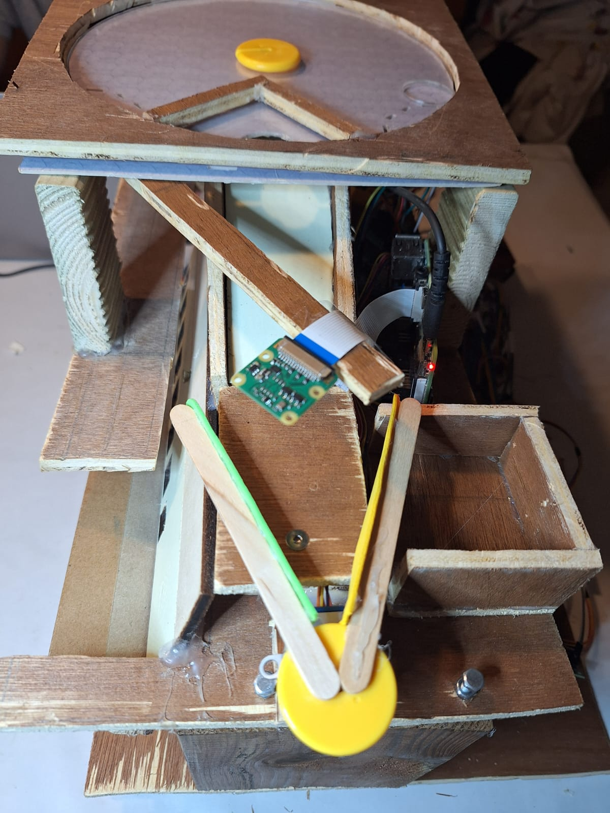
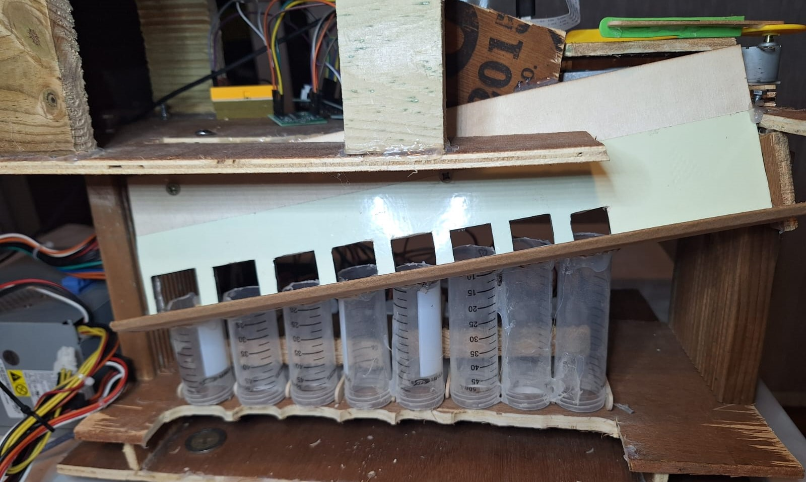
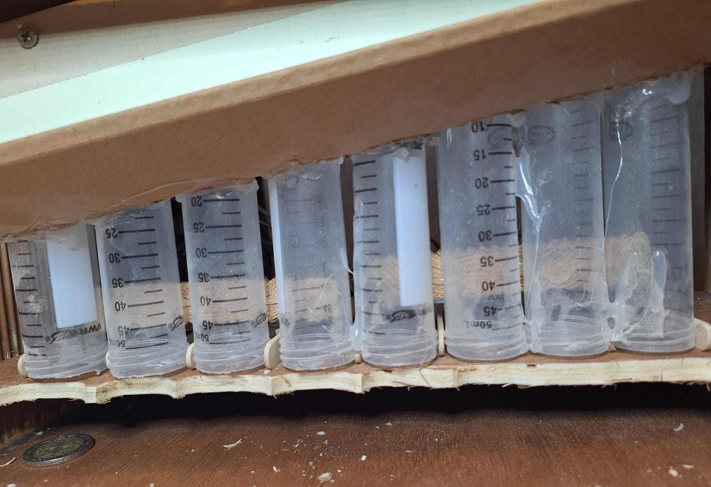
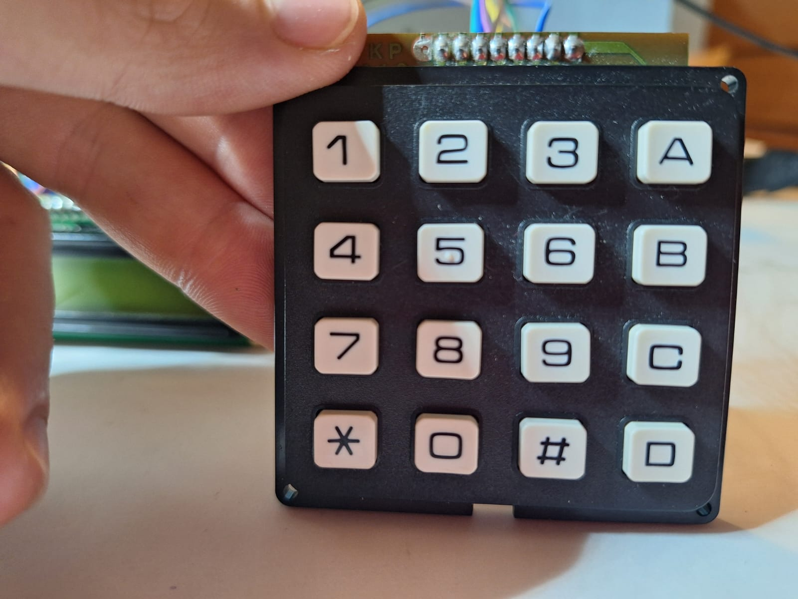

# Cointer

Sistema clasificador con detección de falsificaciones y dispensado óptimo de cambio. Desarrollado como proyecto para la asignatura de Ingeniería Informática, Robótica.

---

## 📋 Descripción

Cointer es una solución robótica integral diseñada para automatizar el proceso de recepción y devolución de monedas en nuestros hogares a modo de hucha y en sistemas de pago físicos. El robot está formado por un módulo de detección por visión y pesaje, que identifica hasta ocho tipos de moneda (2 €, 1 €, 0,50 €, 0,20 €, 0,10 €, 0,05 €, 0,02 € y 0,01 €) determina si se trata de una moneda de euro o no. En caso negativo la descarta y en caso de ser una moneda de euro auténtica, la clasifica automáticamente segun su valor. Seguidamente, calcula en tiempo real el importe depositado. En caso de que el usuario solicite la extracción de un importe, un algoritmo voraz determina la combinación óptima de monedas para devolver el cambio exacto; si no es posible, se recurre a una rutina de respaldo que ajusta la selección.

El hardware integra una Raspberry Pi para la parte de visión y control de alto nivel, junto con un Arduino y hasta ocho motores paso a paso (uno por denominación) manejados por drivers A4988 o ULN2003 para el dispensado mecánico. La parte de software está estructurada en módulos: Monedero, para la lógica de cálculo y gestión de inventario de monedas, y Motores, para el control preciso de cada actuador. Además, un teclado matricial y una pantalla LCD permiten la interacción con el usuario, mostrando saldos, importes y estados del proceso.

Este proyecto combina conocimientos de electrónica, mecánica, visión artificial y diseño de algoritmos para ofrecer un sistema escalable, modular y fiable, ideal para administrar pequeños ahorros en el hogar y aplicaciones en máquinas expendedoras, kioscos de autoservicio y cualquier entorno que requiera gestión automática de monedas.

---

## 📊 Lista de componentes y presupuesto

| Componente                                                            | P. unitario (€) | Cantidad | Subtotal (€) |
| --------------------------------------------------------------------- | ---------------:| --------:| ------------:|
| Raspberry Pi 4 Model B 8 GB RAM                                       |           88,55 |        1 |        88,55 |
| Cámara Raspberry Pi v2 – 8 Megapixels                                 |           19,95 |        1 |        19,95 |
| Pantalla LCD 16×2 con módulo I²C                                      |            7,95 |        1 |         7,95 |
| Motor paso a paso 28BYJ-48 (5 V) con driver ULN2003                   |            2,95 |       10 |        29,50 |
| Arduino Mega2560                                                      |           43,75 |        1 |        43,75 |
| Teclado matricial de 16 botones                                       |            5,50 |        1 |         5,50 |
| Memoria MicroSD Kingston 128 GB (Clase 10)                            |           10,70 |        1 |        10,70 |
| Célula de carga 5 kg con amplificador HX711                           |            4,10 |        1 |         4,10 |
| Fuente alimentación 4 salidas 5/12/−5/−12 125 W                       |           38,50 |        1 |        38,50 |
| **Total**                                                             |                 |          |      **248,5** |

> Consulta `Cointer_RLP_Budget 2.xlsx` para detalles de proveedores, enlaces y fechas de pedido.

---

## ⚙️ Características

- **Lectura de saldo**: muestra por Serial el total de euros disponible.  
- **Entrada de importe**: teclado matricial 4×4 para introducir cantidades con coma (‘*’).  
- **Algoritmo de cambio**: voraz con respaldo y reversión si no hay cambio exacto.  
- **Dispensado**: control de hasta 8 motores paso a paso (uno por cada denominación).  
- **Modularidad**: separa lógica de cálculo de cambio (Monedero) y control de motores (Motores).
- **Escalabilidad**: fácil adaptación a nuevas denominaciones o mecanismos de dispensado mediante configuración de Monedero y mapeo de motores.

---

## 📦 Estructura de ficheros

```text
/  
├─ designs
│   ├─ disseny3D.pdf
│   ├─ disseny3D.step
│   └─ esquema_conexiones.png
├─images
│   ├─ ....
├─ src
│   ├─ arduino
│   │   ├─ lcd.h
│   │   ├─ numpad.h 
│   │   ├─ Monedero.h
│   │   ├─ Monedero.cpp       
│   │   ├─ Motores.h          
│   │   ├─ Motores.cpp        
│   │   ├─ ControlDineroCompleto.ino
|   |   ├─ Testers
|   |   |    ├─ (Código testing componentes)
|   ├─ raspberry
|   |   ├─ Neural_Network
|   |   |   ├─ classify_image.py
|   |   |   ├─ preprocess_image.py
|   |   |   ├─ train_model.py
|   |   ├─  Testers
|   |   |   ├─ (Código testing componentes)
|   |   ├─ config.py
|   |   ├─ main.py
|   |   ├─ motor.py
|   |   ├─ sensor_peso.py
|   |   └─ vision.py
├─ Cointer_RLP_Budget 2.xlsx   # Presupuesto detallado
└─ README.md       
```


## 🛠️ Instalación y compilación
Abre el proyecto en el Arduino IDE (y en VS Code/Thonny para Pi, si lo usas).

Instala la librería Keypad desde el Gestor de Bibliotecas.

Copia los archivos .h, .cpp, el .ino y el .xlsx en la misma carpeta de sketch/repositorio.

Selecciona placa y puerto correctos.

Compila y sube al Arduino; en el Pi, lanza el script de visión si corresponde.

## 📚 Referencias y guías

(Todos los enlaces revisados antes del 25/06/2025)

Para facilitar el montaje y uso de los componentes hardware, se recomienda consultar las siguientes guías y documentación oficiales: [Especificaciones de la Raspberry Pi 4 Model B 8 GB RAM](https://www.raspberrypi.com/products/raspberry-pi-4-model-b/specifications/), [SparkFun HX711 Load Cell Amplifier Hookup Guide](https://learn.sparkfun.com/tutorials/load-cell-amplifier-hx711-breakout-hookup-guide/all), [Documentación de la cámara Raspberry Pi Camera Module V2](https://www.raspberrypi.com/documentation/accessories/camera.html), [Tutorial Arduino LCD 20×4 I²C](https://arduinogetstarted.com/tutorials/arduino-lcd-20x4), [Tutorial 28BYJ-48 + ULN2003](https://m.youtube.com/watch?v=avrdDZD7qEQ), [Especificaciones NEMA 8 en STEPPERONLINE](https://www.omc-stepperonline.com/nema-8-stepper-motor?srsltid=AfmBOoqmatzuIH-c4meWoDXIdkfjG1Q7wuN6U2wMUQBZ23sFILkp7VJc), [Datasheet Luxeon III (LED RGB 3 W) en Farnell](https://www.farnell.com/datasheets/38512.pdf), [SparkFun Qwiic Keypad Hookup Guide](https://learn.sparkfun.com/tutorials/qwiic-keypad-hookup-guide/all), [Documentación Raspberry Pi Pico](https://www.raspberrypi.com/documentation/microcontrollers/raspberry-pi-pico.html), [Datasheet microSDHC/microSDXC Class 10 UHS-I (128 GB) de Kingston](https://www.kingston.com/datasheets/SDC10G2_us.pdf), [A4988 Stepper Motor Driver Carrier – Pololu #1182](https://www.pololu.com/product/1182) y [MPB125-4350G AC-DC 4 salidas 125 W de Bel Fuse](https://www.belfuse.com/products/power-supplies/ac-dc-converters/mpb125-4350g).

# Estructura del robot
## Tambor

Esta es la parte donde se inicializa el funcionamiento del robot. Se colocan el conjunto de monedas a clasificar encima del tambor, este tiene un funcionamiento parecido al de un tambor alimentario, que al rotar, empuja las monedas hacia las paredes de manera que una de las monedas entra en la muesca (de diámetro y altua de una moneda de 2 euros) en el tambor. Una vez da la vuelta es la única moneda capaz de sobrepasar las paredes de madera que delimitan el abujero y cayendo en este y deslizandose por la rampa hasta el sensor de peso.
## Discriminador

Una vez la moneda ha caído por la rampa y se situa en el sensor de peso, la raspberry ordena la detención del motor paso a paso del tambor (usa multithreading, ya que va rotando el motor y va midiendo si hay una variación de peso en el sensor) y mediante la celula de carga se obtiene el peso del elemento que ha sido seleccionado y junto a la imagen capturada de la moneda en este momento mediante la camara de la raspberry, se procede a disriminar usando la red neuronal el objeto (moneda de euro o no). Una vez clasificado, se ordena al otro motor paso a paso a rotar para retirar la moneda del sensor de peso (si la rotación es en sentido horario, se descarta el objeto y se almacena en un pequeño compartimento al lado del sensor de peso. Rotación en sentido antihorario, la moneda cae en la rampa clasificadora) y seguir con el resto de clasificación.
## Clasificador

Una vez sabemos que el objeto seleccionado es una moneda, esta cae sobre la rampa de clasificacion, rodando sobre el canto, y gracias a la inclinación tanto en eje x como en eje y, esta cojerá inercia y caerá en su respectivo compartimento, cayendo en el primer abujero que quepa. Teniendo en cuenta que para hacer esto los compartimentos se ordenan de menor a mayor diametro de la moneda (En orden ascendente de derecha a izquierda se ordenan: 1,2,10,5,20cnts,1€,50cnts,2€).
## Almacenamiento

A esta altura, la moneda ya habrá sido almacenada en el compartimento correspondiente, en cada uno de estos se admite un gran número de monedas que serán extraídas mediante los motores paso a paso, uno para cada tubo.
## Bielas

Para dar pie a la extracción de una cantidad concreta de monedas, usaremos un arduino que se encargará de controlar los 8 motores paso a paso (1 para cada tipo de moneda). Cada motor paso a paso tiene unido una pieza que replica el funcionamiento de una biela manivela, de manera que cuando pedimos la extracción de una o varias monedas, el motor o motores paso a paso correspondientes emujan las monedas. Además con la separación que hay entre cada compartimento y el soporte permite que al empujar con la biela solo salga una moneda aún que en el compartimento se encuentre más de una.
## Numpad

Este es el componente mediante el que solicitaremos la extracción de un importe concreto (esta conectado al arduino). En el caso del numpad usado, antes de extraer un importe deberemos de presionar la tecla "#" y la coma se representa con el caracter "*". Una vez hemos indicado el importe deseado, presionaremos el caracter "C" para confirmar la dispensación. En caso de no querer confirmar la extracción del importe presionarmeos "B" para volver al menú inicial.
## Pantalla

Componente encargado de mostrar por pantalla de forma visual al usuario el contenido y funcionamiento del robot. Inicialmente podremos observar el valor de monedas que se encuentra almacenado (este valor se modifica al clasficar una moneda como moneda de euro gracias a la camara y sensor de peso, este nuevo valor se lo comunica la raspberry al arduino). También podemos ver cuando se esta haciendo una extracció o cuando se intenta hacer de forma errónea, teniendo sus respectivos errores explicativos (demasiados decimales, mas de una coma, valor de extracción nulo, cantidad insuficiente).

# Red Neuronal
Este proyecto utiliza una red neuronal convolucional (CNN) entrenada para clasificar monedas entre 9 categorías:

- `1cent`, `2cent`, `5cent`, `10cent`, `20cent`, `50cent`, `1eur`, `2eur`, `no_coin`

### 📌 Propósito

La red neuronal se encarga de **clasificar automáticamente** la moneda capturada por la cámara al caer en el compartimento de pesaje. Según su clase, el sistema activa el motor correspondiente para enviar la moneda a su recipiente final o la rechaza si es falsa (`no_coin`).

---

### 🧱 Arquitectura del modelo

- Tipo: **Convolutional Neural Network (CNN)**
- Entrenamiento realizado con `TensorFlow/Keras`
- Input: imágenes de tamaño **128x128x3**
- Salida: capa softmax de 9 neuronas (una por clase)

**Resumen del modelo:**
Conv2D → MaxPooling2D → Conv2D → MaxPooling2D → Flatten → Dense → Dropout → Dense(9, softmax)
---

### 🧪 Dataset

- **Datos de entrenamiento:**  
  - Carpeta `Data_train/`  
  - Contiene subcarpetas por clase (`1eur/`, `2cent/`, `no_coin/`, etc.)

- **Tamaño aproximado del conjunto:**  
  - ~60 imágenes por clase  
  - Se aplicó **data augmentation** para compensar la escasez de datos.

---

### 🏋️‍♂️ Entrenamiento

- Librerías usadas:
  - `TensorFlow`, `Keras`, `Pillow`, `NumPy`
- Aumento de datos:
  - Rotación, zoom, flip horizontal y brillo
- Optimización:
  - Función de pérdida: `categorical_crossentropy`
  - Optimizer: `Adam`
  - Métrica: `accuracy`
- Número de épocas: **50**
- Early stopping usado para evitar sobreajuste

---

### 💾 Guardado del modelo

El modelo se guarda como un fichero: modelo_monedas.h5

Este fichero debe colocarse en la raíz del proyecto, junto a `main.py`.

---

### 📤 Inferencia

Durante la ejecución:

1. Se captura una imagen con `libcamera-still`
2. Se redimensiona a 128x128 y se normaliza
3. Se pasa al modelo para predecir la clase
4. Se usa la clase predicha para decidir la acción del motor

---

### 🧪 Precisión

- La red neuronal alcanza una precisión superior al **95%** en validación.
- El sistema es **invariante a rotación y escala** debido al uso de secciones locales de Fourier durante el preprocesado (si se implementa).
- Clasifica correctamente monedas no vistas si están dentro de las clases conocidas.
